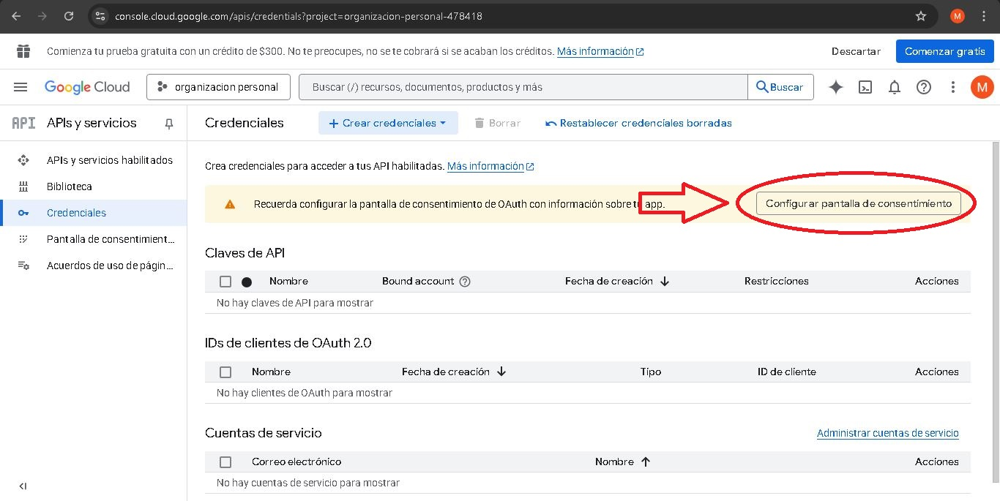
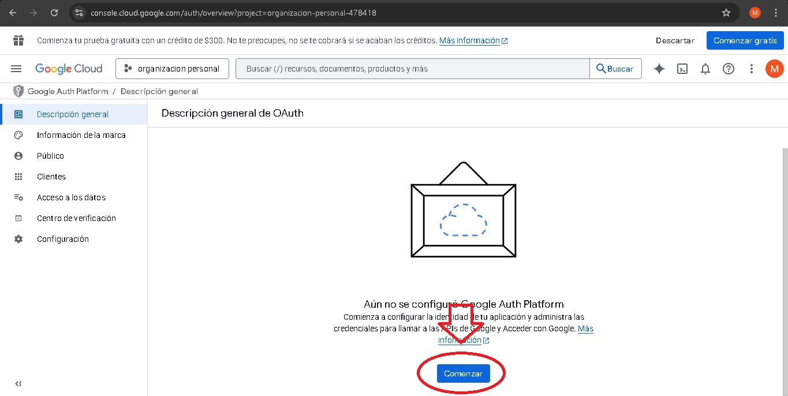
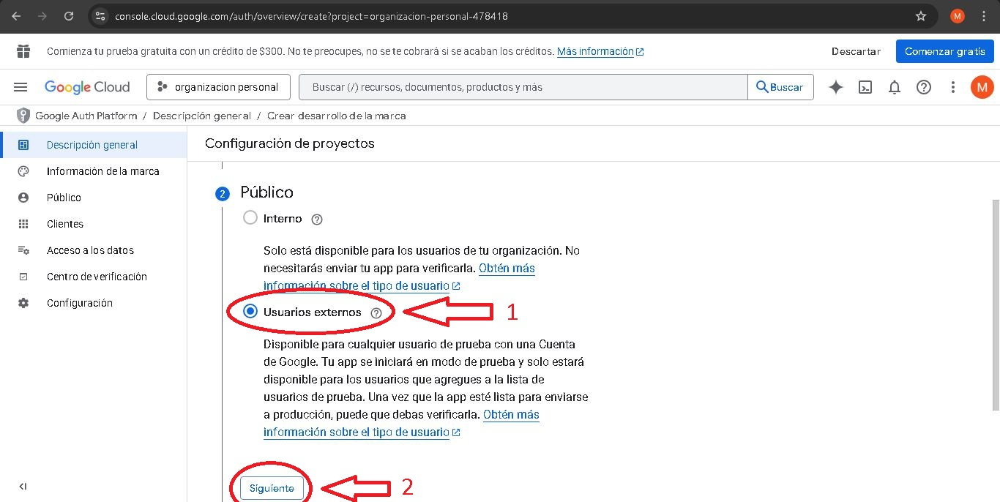
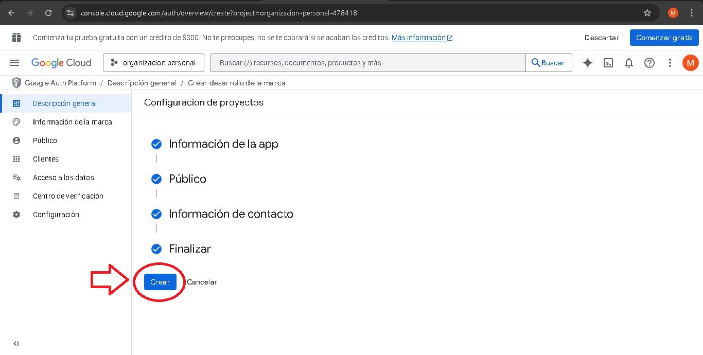

# 🧩 Proyecto: Organizador Personal

Aplicación web desarrollada con **Django**, pensada como un organizador personal integral que permite a los usuarios gestionar sus **tareas, notas y finanzas** de manera simple y eficiente.  
Incluye **autenticación segura con Google OAuth2**, una **interfaz moderna** y **paneles visuales** para controlar y planificar la información diaria desde un mismo lugar.

---

## 📂 Estructura del Proyecto

```
tareas_proyecto/
│
├── tareas_proyecto/              # Configuración principal de Django
│   ├── settings.py
│   ├── urls.py
│   ├── wsgi.py
│   ├── asgi.py
│
├── finanzas/                     # App para control financiero
│   ├── migrations/
│   ├── templates/finanzas/
│   │   ├── dashboard.html
│   │   ├── registros.html
│   │   ├── crear_objetivo.html
│   ├── static/finanzas/css/
│   │   ├── finanzas_dashboard.css
│   │   ├── finanzas_registros.css
│   ├── models.py
│   ├── views.py
│   ├── urls.py
│   ├── forms.py
│   ├── admin.py
│
├── tareas/                       # App de gestión de tareas
│   ├── migrations/
│   ├── templates/tareas/
│   │   ├── crear.html
│   │   ├── editar.html
│   │   ├── lista.html
│   │   ├── dashboard.html
│   │   ├── base.html
│   ├── models.py
│   ├── forms.py
│   ├── views.py
│   ├── urls.py
│   ├── static/tareas/css/
│
├── tareasMauri/                  # App para gestión de notas
│   ├── templates/tareasMauri/
│   │   ├── inicio.html
│   │   ├── notas.html
│   │   ├── crear_notas.html
│   │   ├── editar_nota.html
│   ├── models.py
│   ├── forms.py
│   ├── views.py
│   ├── urls.py
│
├── usuarios/                     # App para autenticación y login
│   ├── templates/usuarios/
│   │   ├── login.html
│   │   ├── registro.html
│   ├── models.py
│   ├── views.py
│   ├── urls.py
│
├── static/                       # Archivos CSS y JS compartidos
│   ├── css/
│   ├── js/
│
├── db.sqlite3                    # Base de datos local (no se sube al repo)
├── manage.py
├── requirements.txt              # Dependencias del proyecto
└── README.md
```

---

## 🚀 Instalación y Ejecución Local

Sigue estos pasos para levantar el proyecto en tu entorno local 👇

---

### 1️⃣ Clonar el repositorio

```bash
git clone https://github.com/Vleontueso78/Proyecto-Django.git
cd Proyecto-Django
```

---

### 2️⃣ Crear y activar el entorno virtual

#### 🪟 En Windows:
```bash
python -m venv venv
venv\Scripts\activate
```

#### 🐧 En Linux / Mac:
```bash
python3 -m venv venv
source venv/bin/activate
```

---

### 3️⃣ Instalar dependencias

```bash
pip install -r requirements.txt
```

---

## 🔑 Crear tu archivo `.env`

Tu proyecto incluye un archivo **`.env.example`**, el cual sirve como **plantilla**.

### ✔ PASO 1 — Crear tu archivo `.env`

Debes crear un archivo llamado:

```
.env
```

En la ruta del proyecto:

```
/tareas_proyecto/.env
```

### ✔ PASO 2 — Copiar el contenido de `.env.example`

Copiá **todo el contenido** de `.env.example` dentro de tu nuevo `.env`.

### ✔ PASO 3 — Reemplazar valores sensibles

Generá una SECRET_KEY válida ejecutando:

```bash
python -c "from django.core.management.utils import get_random_secret_key; print(get_random_secret_key())"
```

Luego reemplazá en tu `.env`:

```
SECRET_KEY=tu_clave_generada_aqui
```

Y finalizá configurando tus claves reales de Google OAuth2 y correo.

---

# 🔐 Configurar inicio de sesión con Google OAuth2

## 1️⃣ Acceder a Google Cloud Console

[Google Cloud Console](https://console.cloud.google.com/)


-   **Selecciona el botón** `Selecciona un proyecto`.

------------------------------------------------------------------------

## 2️⃣ Crear un nuevo proyecto


-   **Selecciona el botón** `Proyecto nuevo`.


-   **Agrega el nombre que quieras en** `Nombre del proyecto`.
-   **No modifiques el campo** `Ubicación`.
-   **Presiona** `Crear`.


-   **Volvé a presionar** `Selecciona un proyecto`.


-   **Selecciona tu proyecto creado**, por ejemplo:
    `organizacion personal`


-   **Presiona el menú** `≡`.

------------------------------------------------------------------------

## 3️⃣ Crear credenciales OAuth2

### Ir a **APIs y servicios → Credenciales**


-   Entrá a `APIs y servicios` → `Credenciales`.



-   Click en **Configurar pantalla de consentimiento**.



-   Click en `Comenzar`.

------------------------------------------------------------------------

## Pantalla de consentimiento


1.  Completar `Nombre de la aplicación`.
2.  Completar `Correo electrónico de asistencia del usuario`.
3.  Presionar `Siguiente`.



1.  Seleccionar **Usuarios externos**.
2.  Presionar `Siguiente`.


1.  Agregar un correo en `Direcciones de correo electrónico`.
2.  Presionar `Siguiente`.


1.  Tildar la casilla de políticas.
2.  Presionar `Continuar`.



-   Presionar `Crear`.

------------------------------------------------------------------------

## Crear credenciales OAuth


-   Presionar `Crear cliente de OAuth`.


1.  Seleccionar **Aplicación web**.

2.  Escribir un nombre.

3.  En **Orígenes autorizados**, agregar:

        http://127.0.0.1:8000

4.  En **URIs de redireccionamiento autorizados**, agregar:

        http://127.0.0.1:8000/oauth/complete/google-oauth2/
        http://localhost:8000/oauth/complete/google-oauth2/

5.  Presionar `Crear`.

------------------------------------------------------------------------

## 4️⃣ Agregar credenciales a `.env`

``{=html}

1.  Copiar el **ID de cliente** → pegarlo en
    `SOCIAL_AUTH_GOOGLE_OAUTH2_KEY`
2.  Copiar el **Secreto de cliente** → pegarlo en
    `SOCIAL_AUTH_GOOGLE_OAUTH2_SECRET`
3.  Presionar `Aceptar`

``` env
SOCIAL_AUTH_GOOGLE_OAUTH2_KEY=TU_CLIENT_ID
SOCIAL_AUTH_GOOGLE_OAUTH2_SECRET=TU_CLIENT_SECRET
```

---

### 5️⃣ Crear la base de datos local

```bash
python manage.py makemigrations
python manage.py migrate
```

---

### 6️⃣ Crear un superusuario

```bash
python manage.py createsuperuser
```

---

### 7️⃣ Ejecutar el servidor

```bash
python manage.py runserver
```

👉 Luego abrí tu navegador en:  
[http://127.0.0.1:8000/](http://127.0.0.1:8000/)

---

## ⚙️ Aplicaciones del Proyecto

| Aplicación      | Descripción |
|-----------------|-------------|
| `tareas`        | Permite crear, editar y organizar tareas personales. |
| `tareasMauri`   | Sistema de notas personales y recordatorios. |
| `finanzas`      | Registro de gastos, ingresos y objetivos financieros. |
| `usuarios`      | Autenticación, login y registro (con soporte para Google OAuth2). |

---

## 🧠 Tecnologías Utilizadas

- **Python 3**
- **Django 5**
- **SQLite3**
- **Google OAuth2**
- **HTML / CSS / Bootstrap 5**

---

## 💡 Autor

👤 **Victor T.**  
Desarrollado como parte del **Proyecto final de la diplomatura en Desarrollo de software**.  
📬 GitHub: [vleontueso78](https://github.com/vleontueso78)
